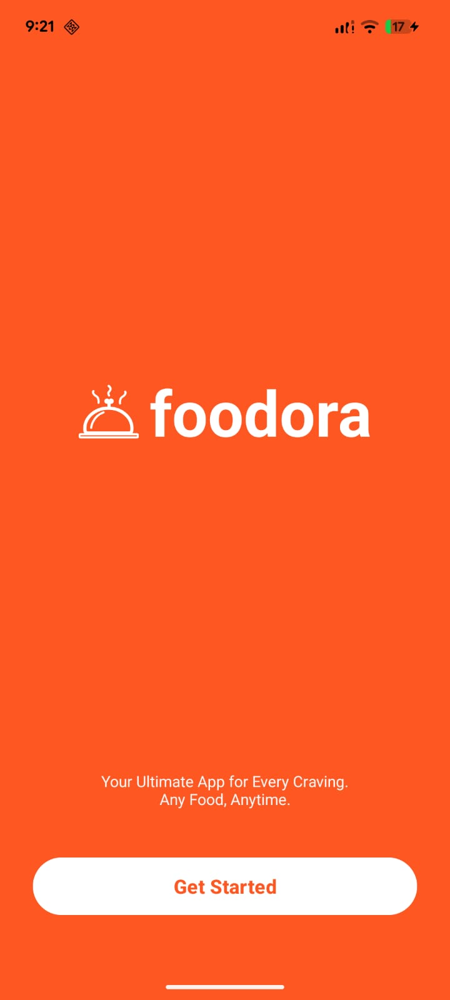
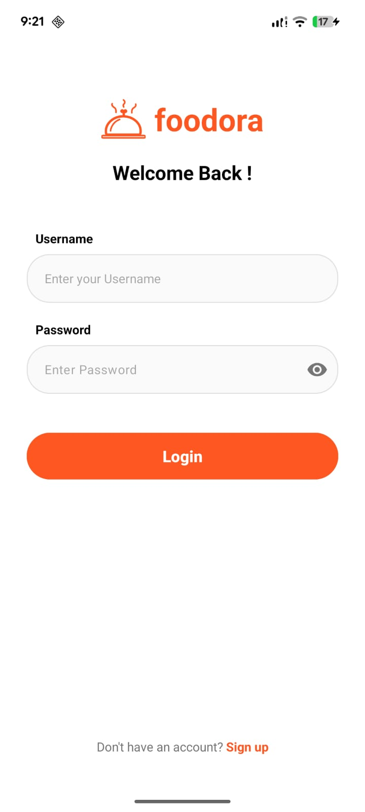
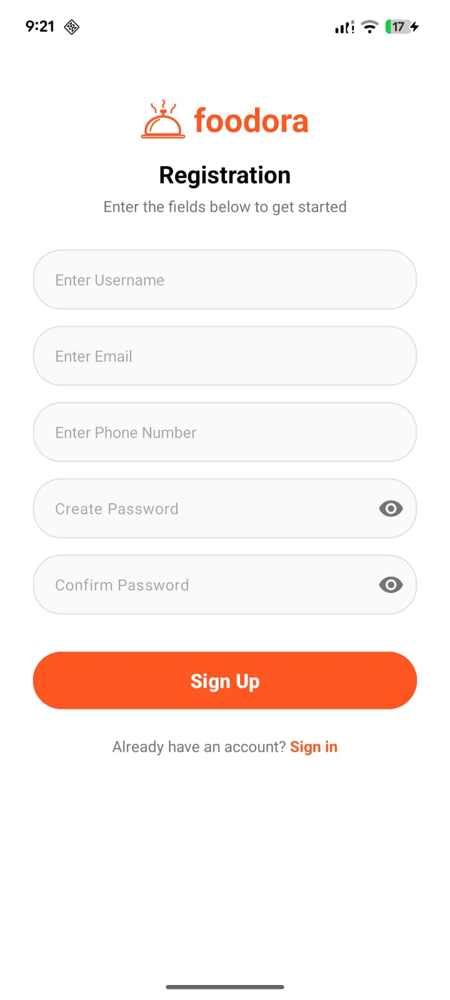
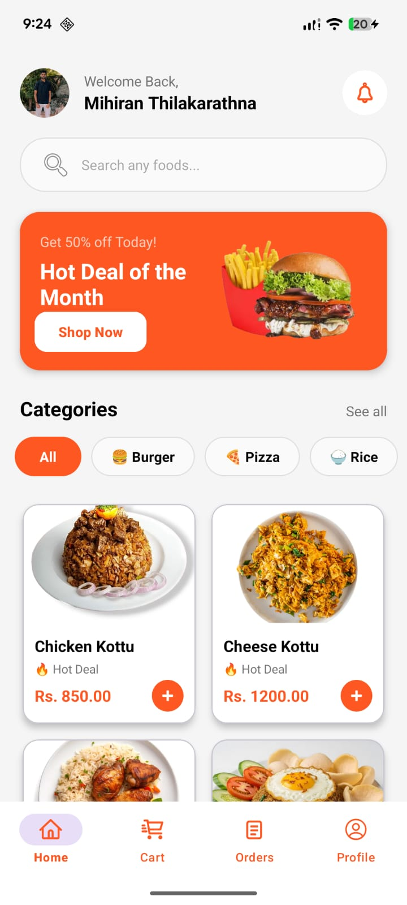
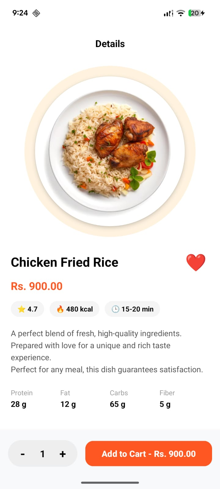
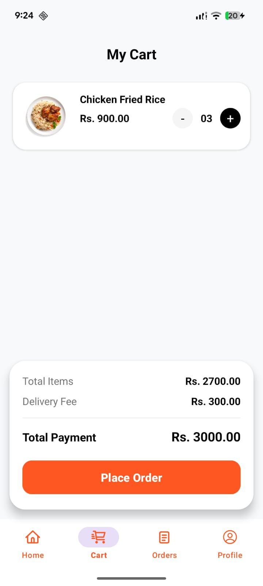
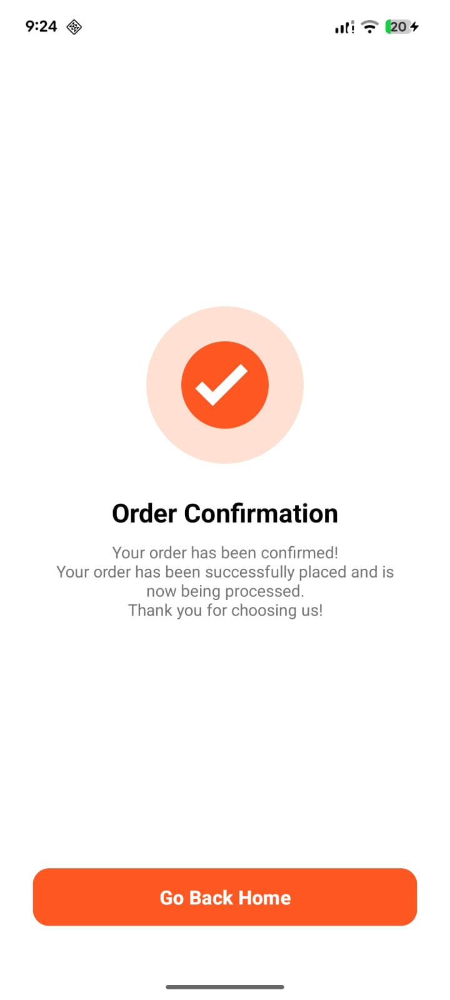
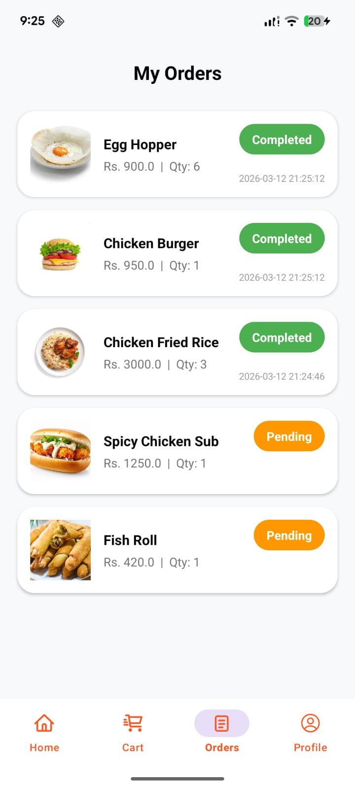
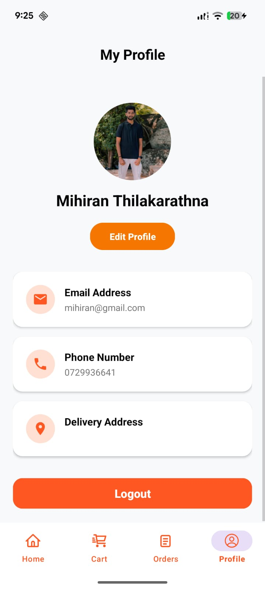
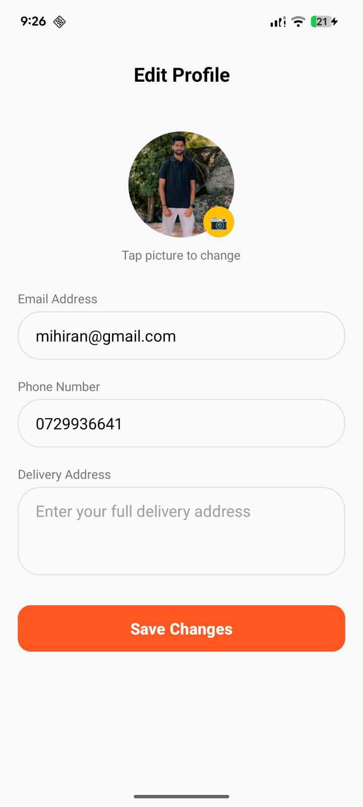

# Foodora - Android Food Ordering App 🍔📱


## 📌 Project Overview

**Foodora** is a fully functional, offline-first Android mobile application developed for the **ICT3214 - Mobile Application Development** module. The application provides a seamless food ordering experience, allowing users to browse a dynamic menu, view detailed item descriptions, manage a shopping cart, place orders, and manage their personal profiles.

Built entirely with **Java** and **SQLite**, the app demonstrates robust local data management, strict security practices, and a highly polished, modern user interface.

---

## ✨ UI Showcase

<table>
  <tr>
    <td align="center"><b>Welcome</b></td>
    <td align="center"><b>Login</b></td>
    <td align="center"><b>Register</b></td>
    <td align="center"><b>Home</b></td>
    <td align="center"><b>Food Details</b></td>
  </tr>
  <tr>
    <td></td>
    <td></td>
    <td></td>
    <td></td>
    <td></td>
  </tr>
  <tr>
    <td align="center"><b>Cart</b></td>
    <td align="center"><b>Order Confirm</b></td>
    <td align="center"><b>My Orders</b></td>
    <td align="center"><b>Profile</b></td>
    <td align="center"><b>Edit Profile</b></td>
  </tr>
  <tr>
    <td></td>
    <td></td>
    <td></td>
    <td></td>
    <td></td>
  </tr>
</table>

---

## 🚀 Core Features & Highlights

### 🔒 Security & Authentication
* **Encrypted Passwords:** Passwords are mathematically hashed using the secure **SHA-256** algorithm before saving to the database.
* **Smart Validation:** Comprehensive input validation including strictly enforced email formats and minimum password length requirements.
* **Case-Insensitive Login:** Enhanced user experience by intelligently handling case-insensitive username inputs during authentication.
* **Session Management:** Secure and persistent auto-login handling using Android `SharedPreferences`.

### 🎨 Premium UI/UX
* **Immersive Display:** Modern, edge-to-edge full-screen design providing a seamless and highly engaging user experience.
* **Material Design:** Clean and intuitive interfaces utilizing Material components, custom vector graphics, and accessible bottom navigation.
* **Unified Brand Identity:** Consistent styling, typography, and custom UI elements across all screens to reflect a premium brand look.

### 🛒 E-Commerce Functionality
* **Dynamic Menu & Search:** Real-time search filtering and categorized browsing (All, Burgers, Pizza, Rice).
* **Smart Cart System:** Real-time subtotal and total payment calculations, seamlessly integrating fixed delivery fees.
* **Unified Order Tracking:** A comprehensive 'My Orders' screen utilizing relational database queries to display both **Pending** (in-cart) and **Completed** orders with distinct visual status badges.

### 👤 Profile Management
* **Personalization:** Users can personalize their accounts by uploading a profile picture directly from their device gallery.
* **Data Management:** Easy-to-use interface to view and update personal information, including contact details and delivery addresses.

---

## 📂 Project Architecture & Structure

The project follows a modular structure for maintainability and clear separation of concerns:
```text
com.example.foodorderingapp
│
├── activities/       # UI Controllers (MainActivity, LoginActivity, CartActivity, etc.)
├── adapters/         # RecyclerView Data Binders (FoodAdapter, CartAdapter, OrderAdapter)
├── database/         # SQLite schema, queries, and seeding logic (DBHelper)
├── models/           # Data structures/POJO classes (FoodModel, CartModel, OrderModel)
└── utils/            # Helper tools (SessionManager for SharedPreferences)
```

## 🛠️ Technologies Used
* **Programming Language:** Java (Android SDK)
* **Local Database:** SQLite (Managed via SQLiteOpenHelper)
* **IDE:** Android Studio
* **Version Control:** Git & GitHub
* **UI Components:** AndroidX, Material Design Components (MDC)

---

## 👥 Team Details & Work Breakdown

We utilized a **Vertical Slicing** approach, ensuring every member contributed to the UI, Logic, and Database tiers of their respective assigned features.

| Index No | Registration No | Name | Role & Core Responsibilities | GitHub Profile |
| :---: | :---: | :--- | :--- | :---: |
| 5707 | ICT/2022/104 | T.H.M. Thilakarathna | Auth, Profile & UI Integration: Login/Register, SHA-256, Profile Management, Home UI, Overall UI Enhancements | [@Mihiran-Thilakarathna](https://github.com/Mihiran-Thilakarathna) |
| 5708 | ICT/2022/105 | M.I Afthal Ahamad | Menu & Dashboard: Food Detail View, Search/Filter Logic, RecyclerView setup, SQLite Food Seeding | [@afthal-ahamad01](https://github.com/afthal-ahamad01) |
| 5709 | ICT/2022/106 | M.A.F Nuha | Cart & Orders: Cart UI, Order Confirmation, Unified Order History, Subtotal logic, User-specific data filtering | [@nuha-akil](https://github.com/nuha-akil) |

---

## ⚙️ Installation & Setup Instructions

To run this project locally on your machine:

1. **Clone this repository**
```bash
git clone https://github.com/Mihiran-Thilakarathna/FoodOrderingApp.git
```

2. **Open the project in Android Studio**
   Launch Android Studio > File > Open > Select the cloned folder.

3. **Sync Gradle**
   Allow Android Studio to download required dependencies and sync the Gradle files.

4. **Build and Run**
   > **Note:** Ensure any previous versions of this app are uninstalled from your device to prevent database schema conflicts.

   Select your Emulator or connected physical device and click **Run** (`Shift + F10`).

---

